# GIT COMMANDS

Here i tried to use and explain git commands in the git command line. Files are empty!

So firstly i created index.html file and 2 folder css/style.css and js/index.jss .

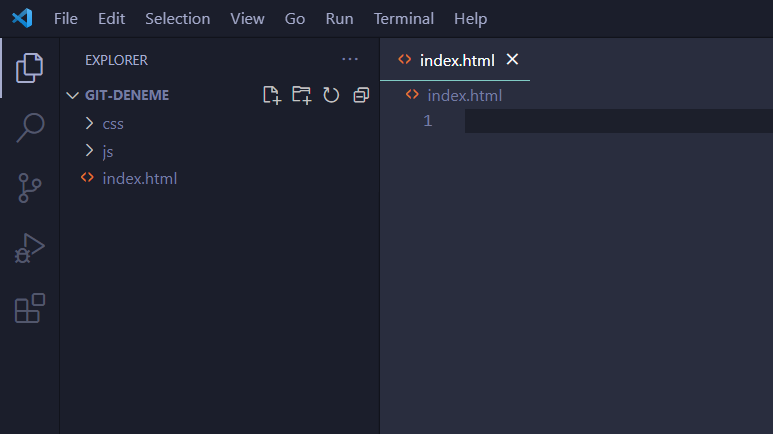

Clicking git bash here.

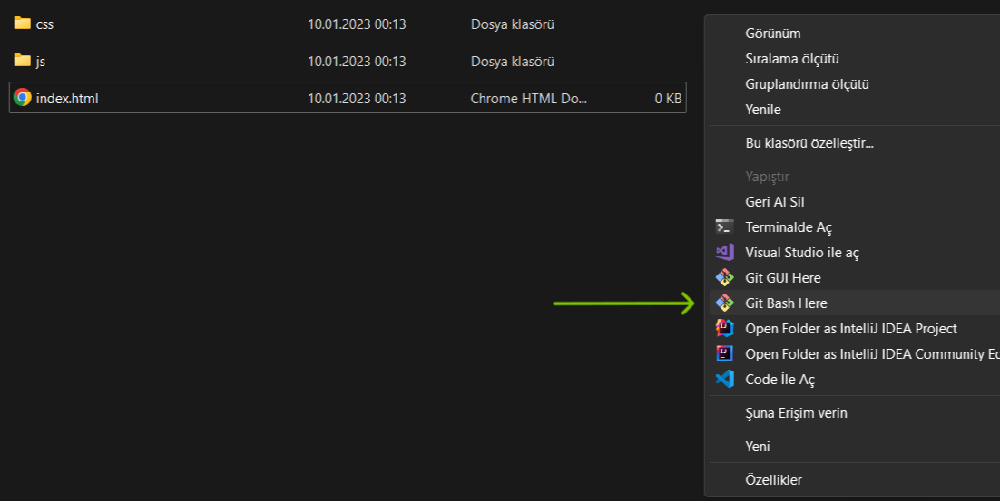

Then we will see the git command line.

## - git init

Here we use **- git init** command for creating a repository in local.

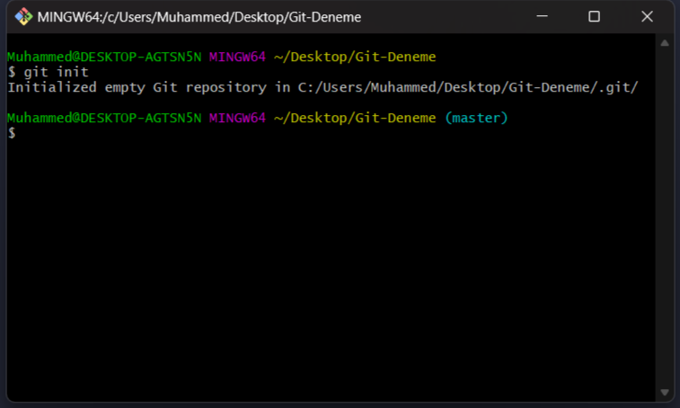

## - git status

After we creating our repository we need to add our files to repository for tracking.
It is empty when we create it.

We can use **- git status** command to see which files are not tracked and which ones are modified etc.

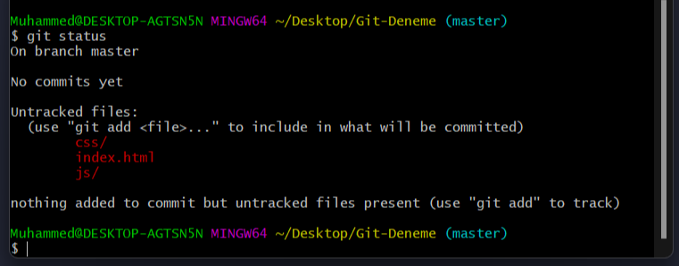

## - git add, - git commit

We need to save our files to repository so firstly we need to use **- git add** command. 

The **- git add** command adds a change in the working directory to the staging area. It tells Git that you want to include updates to a particular file in the next commit. However, **- git add** doesn't really affect the repository in any significant way—changes are not actually recorded until you run **- git commit**.

In conjunction with these commands, you'll also need **- git status** to view the state of the working directory and the staging area.

*- git add index.html*

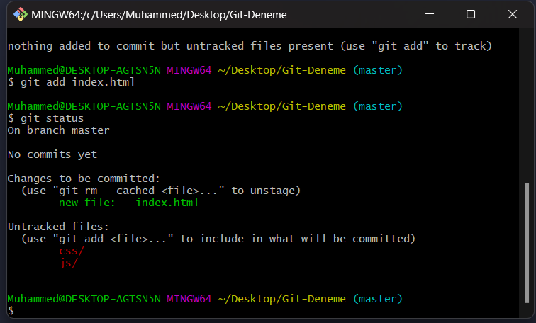

After adding we need to save it to local repository with **- git commit**.

The **- git commit** command takes our added files and loads them to repository with message.

Usage : - git commit -m 'your messsage'. I wrote my message like that *'index.html added'*.

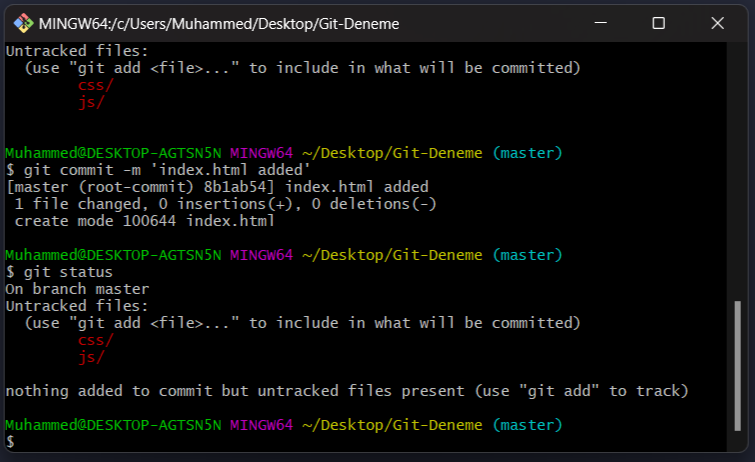

We can also add all files directly with *- git add .* <-- (dot).

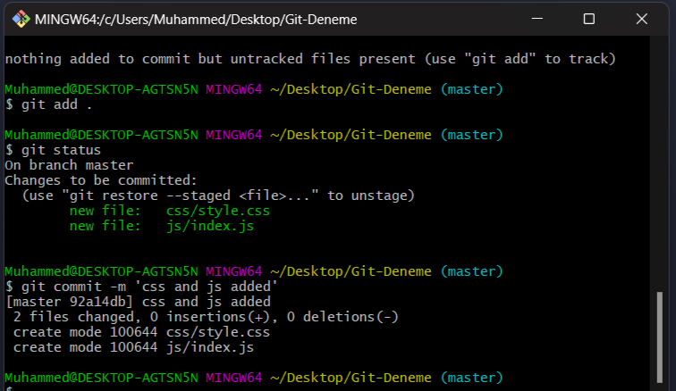

## - git log

If we want to see log history for our commits we can use **- git log**.

So basically **- git log** shows us the our commits' log.

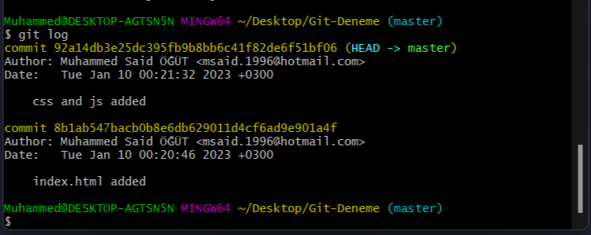

## - git branch, - git checkout, - git switch

**- git branch** command lists us all branches we have in our repository.

Also we can use *- git branch newBranch* to create a new branch and *- git branch -D oldBranch* or *- git branch -delete oldBranch* to remove branch.

**- git checkout** and **- git switch** commands switch between branches.

We can use *- git checkout -b newBranch* to create and jump to new branch quickly.

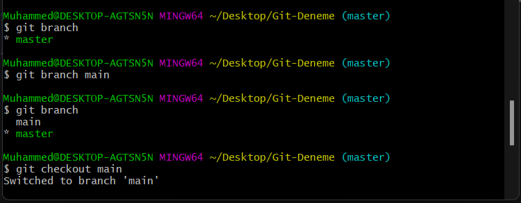

When we create new branch from oldBranch, it copies all the files to itself from oldBranch. We can also see log history.

## - git diff

Here i created *main.html* file with using *touch*, after i commited this, wrote some text in it like *This is main branch html file*. Then i commited the changes again. 

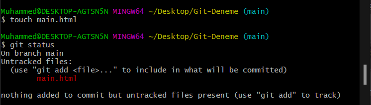

After that i used **- git diff** command to see the difference between to commits.

There are so much using of **- git diff**, here i just used it to see the difference between 2 commits with using their ID.

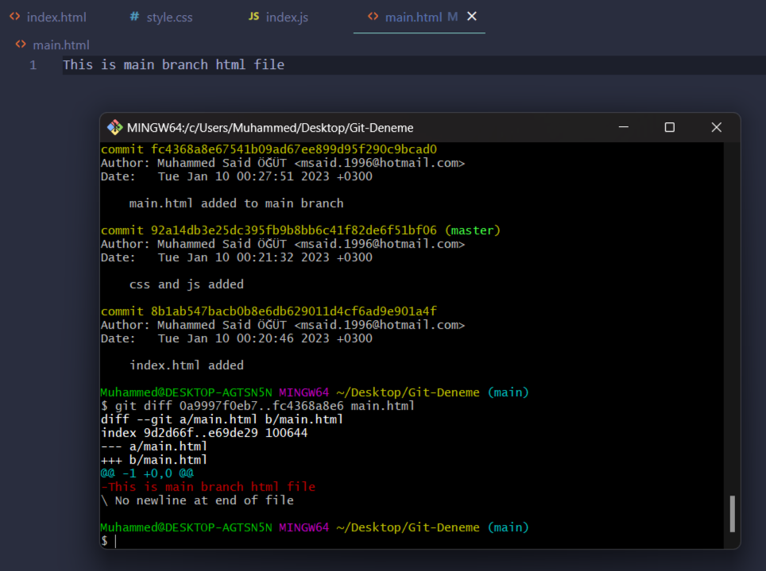

Actually i added *This is main branch html file* this line but in image it is like deleting operation that is because of the commit IDs need to change place i wrote wrong places (1..2 should be 2..1).

## - git merge, - git rebase

To combine two branches we can use **- git merge** or **- git rebase**.

Think it like we are on the main branch : *- git merge childBranch* --> loads all changes from childBranch to mainBranch, loads all log commit history to main log commit history and creates a new commit about merged.

--------------------------------------------------------------------------------------------------------------------------------------
main log  : -A-B-C              --->>>   after merged main :-A-B-C-D-E-F-G 
child log :-A-B-C-D-E-F           

---------------------------------------------------------------------------------------------------------------------------------------

*- git merge --squash childBranch* -->  loads all changes from childBranch to mainBranch but do not loads commit history and do not creates a new commit about merged, if you use this you need to commit a new message after merged.

---------------------------------------------------------------------------------------------------------------------------------------
main log  : -A-B-C              --->>>   after merged main : -A-B-C-G        
child log : -A-B-C-D-E-F  

---------------------------------------------------------------------------------------------------------------------------------------

*-git rebase childBranch* --> Doing same thing with merge but do not add a commit about merged. Seems like all operations commited in the main.

---------------------------------------------------------------------------------------------------------------------------------------
main log  : -A-B-C              --->>>  after merged main : -A-B-C-D-E-F    
child log : -A-B-C-D-E-F

---------------------------------------------------------------------------------------------------------------------------------------

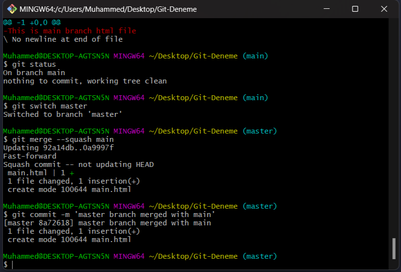

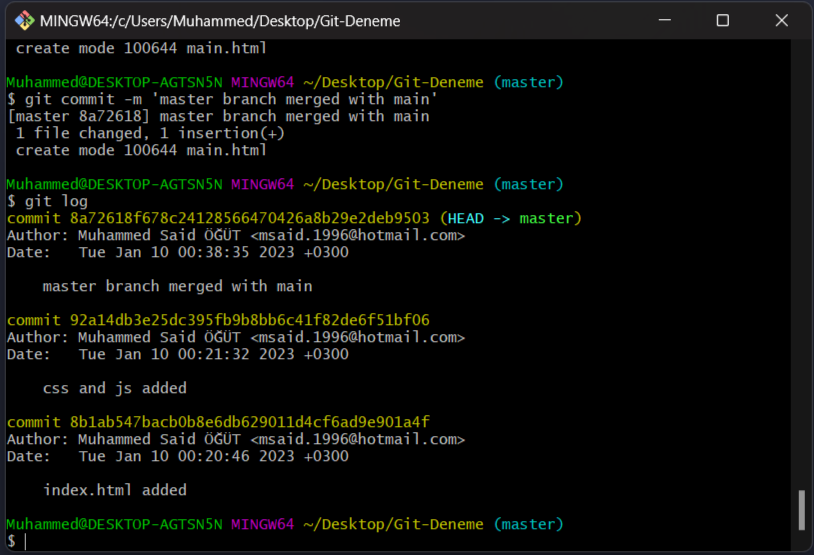

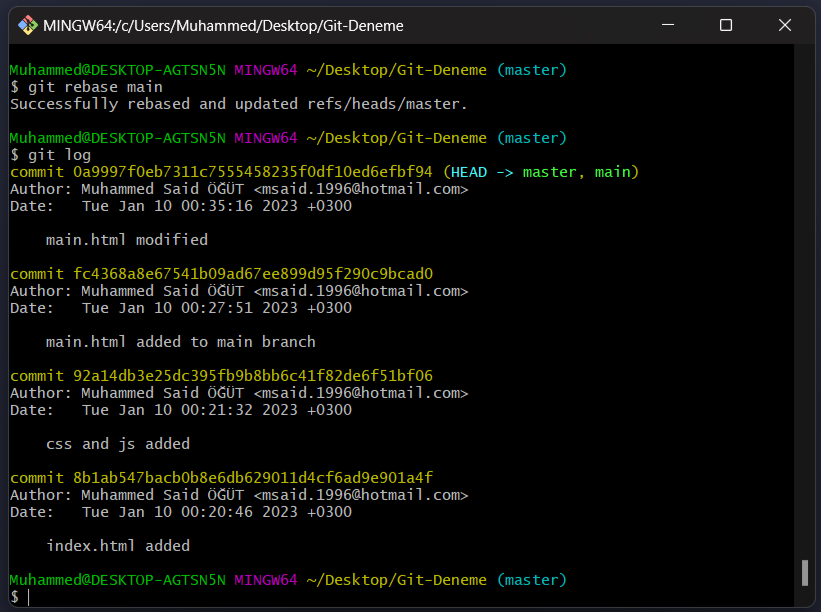

## - git reset, - git revert

Think your log history like this : A-B-C-D

--------------------------------------------
| A:-> A file added   | C:-> C file added  |
|---------------------|--------------------|
| B:-> B file added   | D:-> D file added  |

And you do not want C file in your project anymore. So you can use **- git revert**.

*- git revert commitID* after this C file removed from project but new commit added about C reverted.

LOG HISTORY : A-B-C-D  ----->>> AFTER REVERT : A-B-C-D-E

If you want go back to B commit and do not want to see C and D commits in your log history you can use **- git reset**.

*- git reset --hard commitIDForB* so you can call back the commit with this line.

LOG HISTORY : A-B-C-D  ----->>> AFTER RESET : A-B

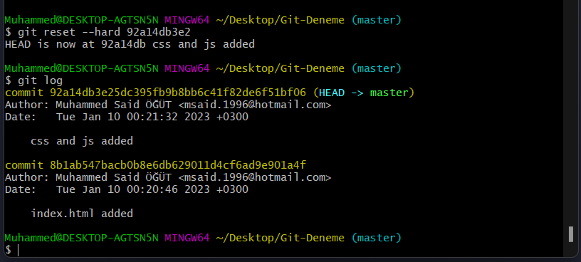

Here i used **- git rebase** after reset.

## - git stash

**- git stash** command is very useful command. When you working, someone can say "send the updated code" but you don't want to send it because after last commit you wrote hundreds of lines and don't want to lose it or copying all the changes somewhere else and you can't commit because it's not working yet you need to write some code.

If you have problem like this you can use **- git stash**. It will stack your all code changes which after your last commit and when you need it you can take it back from the list. 

Here i created stash.html and used **- git stash** command.

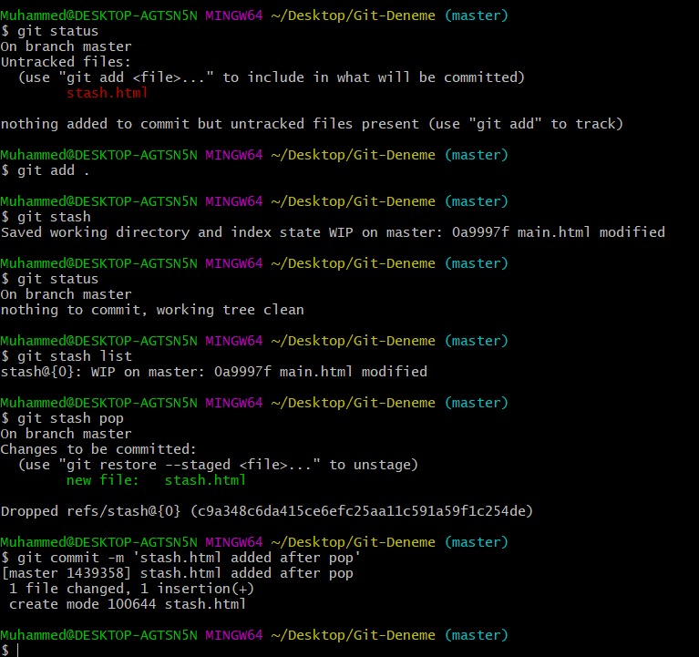

## - git push

**- git push** command is used to upload local repository content to a remote repository.

If you are done! and you want to save your project in the remote repository you need to do the followings ...

*- git branch -M main* 

*- git remote add origin ...your_remote_repository_adress.git...* 

*- git push -u origin main* 

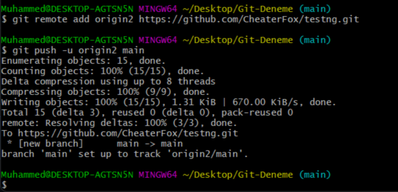

